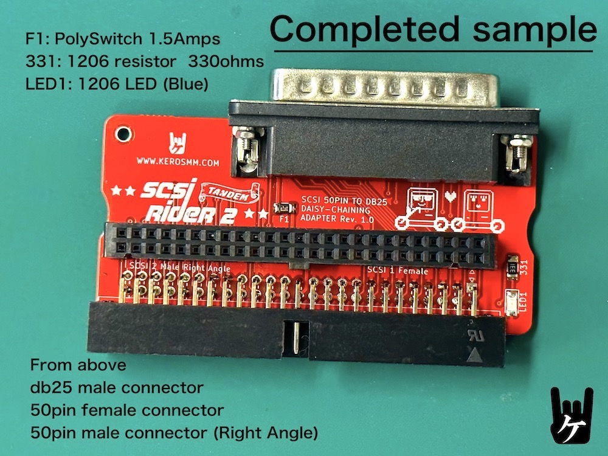
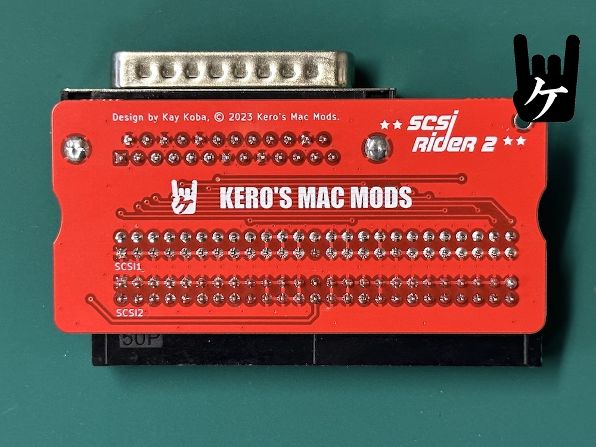
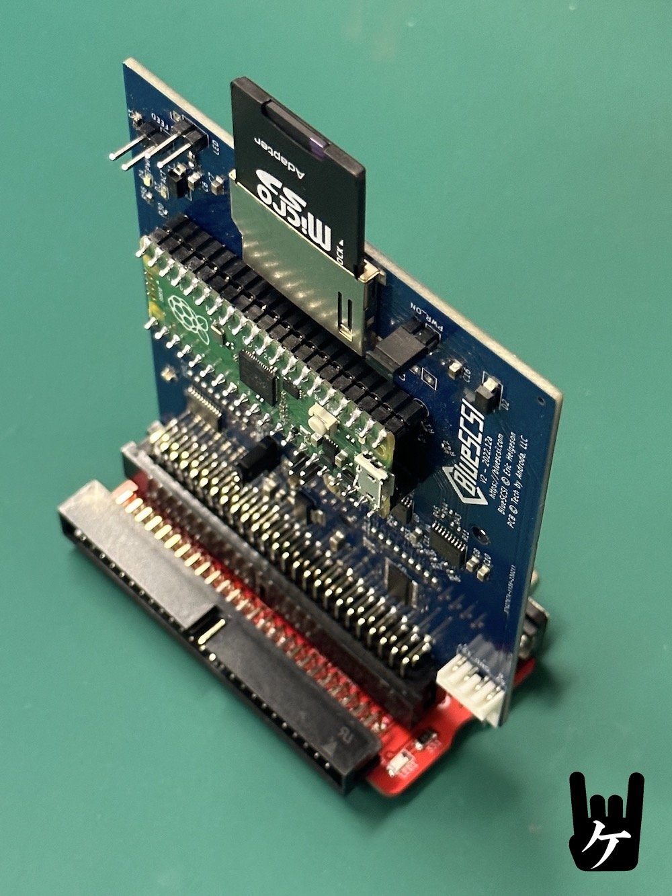
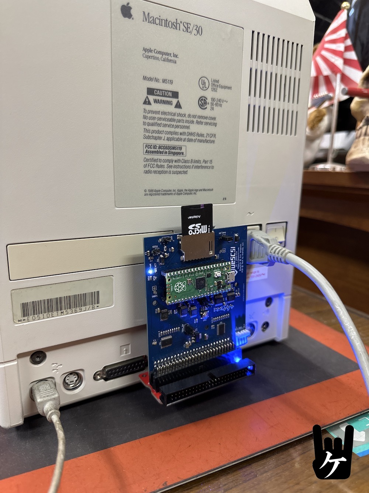

 
　
　
# What kind of product is this
This SCSI RIDER 2 is riser card for connecting SCSI devices like BlueSCSI V2 to the external SCSI db25 connector.
Especially designed for Mac SE/30, SE...
 
The device to be installed is mainly assumed to be 
*[BlueSCSI](https://github.com/erichelgeson/BlueSCSI)*
 
  
 
More details here (My Blog):
  https://ameblo.jp/keroxiee1016/entry-12782849654.html

## Assemble

Check out the [Assembly](Assembly.md) when you're ready to get started.

## Supported Macs

 
*SCSI RIDER with SE/30
  
This works on most 68K Macs and PPC Macs as long as there is no physical interference. My intended use is mainly for testbenches.

## Gerber files

You can use it by compressing [SR2_Gen_Gerber](SR2_Gen_Gerber)  and uploading it to JLCPCB as it is.

  
##　SCSI RIDER 2 Kit

If you want a quick kit, you can buy it at my store below. It is 6 USD.

## License

This work is licensed under a
[Creative Commons Attribution-ShareAlike 4.0 International License](https://creativecommons.org/licenses/by-nc-sa/4.0/).
